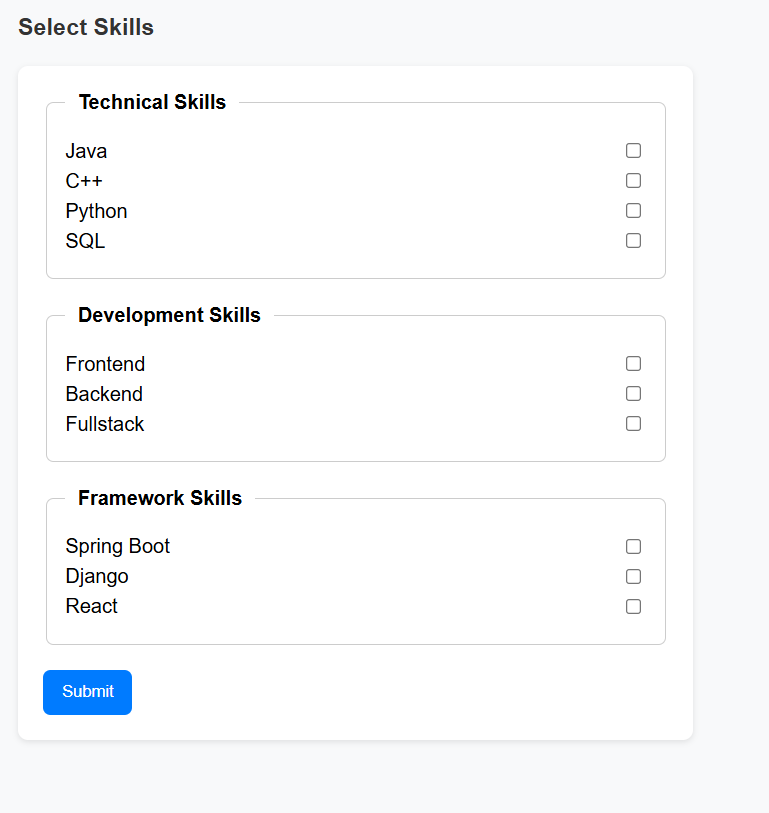
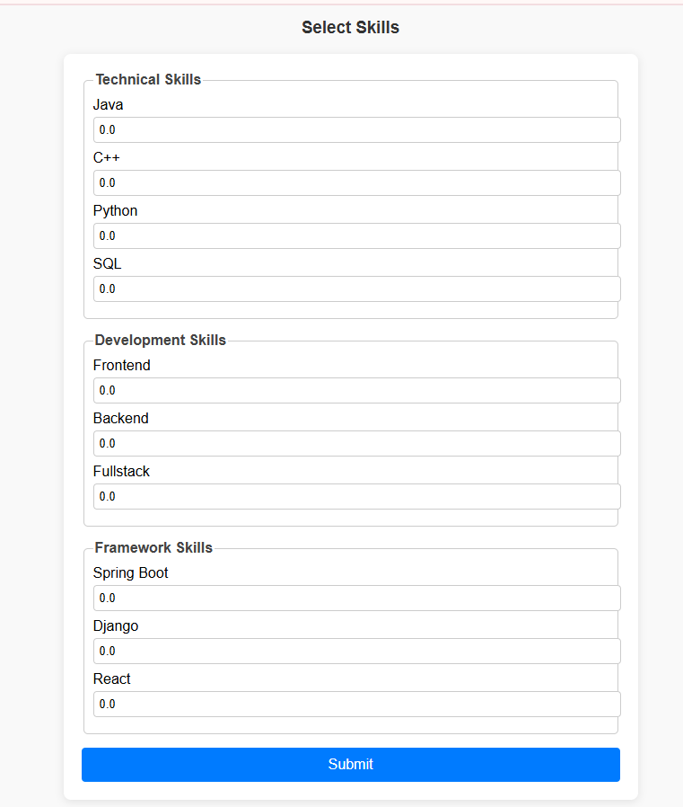
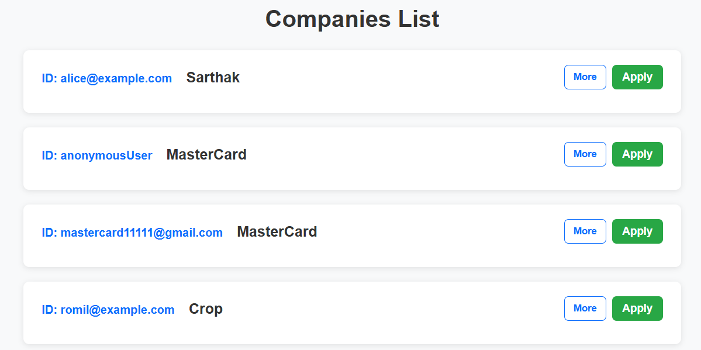
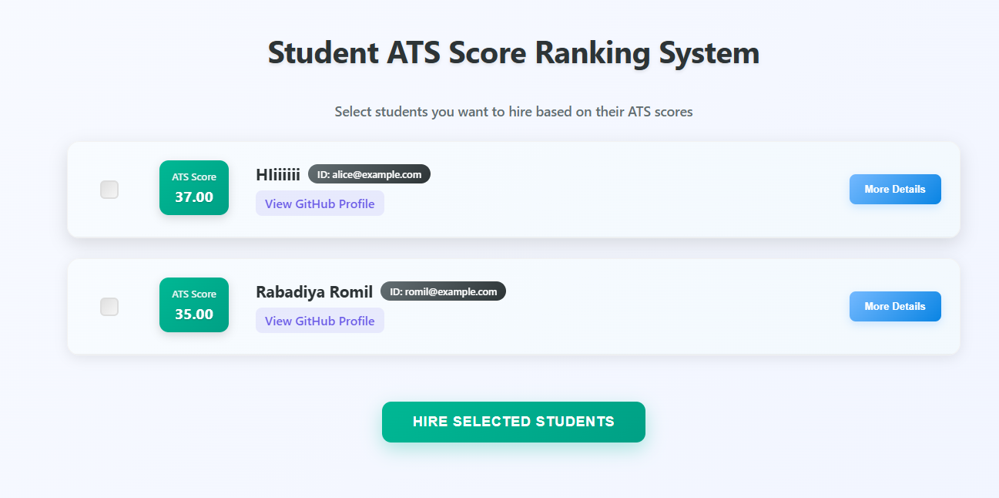

# 🎓 Student Placement & ATS Score Management System

## 🚀 Overview
The Student Placement Management System is a **Spring Boot–based web application** that automates the campus recruitment process.  
It centralizes the management of students, companies, required skills, applications, and placements, helping universities, students, and companies collaborate effectively.

---

## 📊 Use Cases
- **Students**: Build digital profiles, apply for jobs, track placement offers.  
- **Companies**: Post job openings, filter eligible students, shortlist based on ATS scores.  

---

## 🎯 Features

### 👨‍🎓 Student Features
- Register & login with role-based access (**Student role**).  
- Create/update profile including:
  - Name, Email, Mobile  
  - Enrollment & Graduation dates  
  - Department (branch) and CGPA  
  - Resume / portfolio links (GitHub, LinkedIn, certifications).  
- Placement Status Tracking → *Placed / Not Placed*.  
- Add and update skills from the Required Skills module.  
- Browse and view available company job postings.  
- Apply for jobs directly from the student dashboard.  
- View list of companies where they are shortlisted / hired.  

### 🏢 Company Features
- Register & login with role-based access (**Company role**).  
- Maintain company profile (name, HR contact details, job description).  
- Post and manage job openings with requirements like:
  - Job role, Location, Salary, Application deadlines  
  - Minimum CGPA and department eligibility  
  - Weighted required skills (importance score 0–10)  
- Update / delete job postings anytime.  
- View all student applicants for a job.  
- Filter students by:
  - Department  
  - CGPA  
  - Skills match (via ATS Score)  
  - Placement status (*Placed / Not Placed*)  
- Generate **ATS (Applicant Tracking System) Score** for applicants to rank them automatically.  
- Select & mark shortlisted / hired candidates.  

---

## 📊 ATS Score Calculation
1. Company posts job requirements with a set of **Required Skills**, each with a weight (0–10).  
   - Example:  
     - Java → 10  
     - Spring Boot → 8  
     - SQL → 6  

2. Student profile contains their own skills (no weights, just list of skills).  

3. **ATS Calculation Algorithm**:
   - For each required skill in the company’s posting:  
     - If student has the skill → add company’s assigned weight.  
     - If student does not have the skill → add nothing.  
   - **Final ATS Score = Sum of all matched skill weights**  

👉 Higher ATS → better match for the job.  

---

## 📊 Placement & Skill Management
- Students can have multiple skills.  
- Companies define required skills for job roles.  
- System matches skills between students and company requirements.  
- Supports skill categories:
  - Technical (Java, Python, SQL, etc.)  
  - Development (Frontend, Backend, Fullstack, Problem-Solving)  
  - Frameworks (Spring Boot, React, Django, etc.)  
- Uses ATS algorithm to generate compatibility scores.  

---

## 🔒 Security Features
- **Authentication & Authorization** via Spring Security.  
- **Password encryption** with BCrypt.  
- Role-based access control:
  - **STUDENT** → Dashboard, Profile Management, Job Applications  
  - **COMPANY** → Job Postings, Applicant Filtering, ATS Scoring  
  - **ADMIN** → User Management, Placement Status Tracking  
- Access restrictions:  
  - Students cannot access company pages.  
  - Companies cannot edit student profiles.  

---

## 🛠️ Tech Stack
- **Frontend**: Thymeleaf, HTML5, CSS3, Bootstrap  
- **Backend**: Spring Boot, Spring MVC, Spring Security  
- **Database**: MySQL (with JPA/Hibernate ORM)  
- **Other Tools**: Maven, JDK 17+, Git/GitHub  

---

## 📌 Entity Descriptions

### 🧑‍🎓 Student Entity
- Represents a student registered for placement.  
- Stores personal info: name, email, department, CGPA, placement status, and links (GitHub, LinkedIn, certificates).  
- Linked to a **RequiredSkill** object to capture skills.  

### 🏢 Company Entity
- Represents a company posting job requirements.  
- Stores company details: name, job role, experience, location, salary, application dates.  
- Linked to a **RequiredSkill** object for required skills.  

### 🛠️ RequiredSkill Entity
- Represents a collection of skills.  
- Categories:
  - Technical Skills (Java, Python, SQL)  
  - Development Skills (Problem-solving, OOP, System Design)  
  - Framework Skills (Spring Boot, React, Angular)  
- Used by both **Student** (skills possessed) and **Company** (skills required).  

### 🔗 Relations Between Entities
1. **Student ↔ RequiredSkill** → `@OneToOne`  
   - Each student has one set of skills stored in `RequiredSkill`.  
2. **Company ↔ RequiredSkill** → `@OneToOne`  
   - Each company defines required skills for a job role, stored in `RequiredSkill`.  

---

## 🔄 Student Placement Process Flow

### 🧑‍🎓 1. Student Registration & Skill Submission
- Student registers (`/jobs/Register`) with role **STUDENT**.  
- Fills personal & skill details.  
- Selects skills from predefined list:  
  - Technical → Java, C++, Python, SQL  
  - Development → Frontend, Backend, Fullstack  
  - Framework → Spring Boot, Django, React  
- Selected skills stored in `RequiredSkill` entity.  

---

### 🏢 2. Company Registration & Job Requirement Setup
- Company registers with role **COMPANY**.  
- Defines required skills with **weights (0–10)**.  
- Stored in `RequiredSkill` entity.  

---

### 📩 3. Student Applies for a Company
- Student browses jobs (`/jobs/ → student-home`).  
- On applying:  
  - Creates an `ApplyRelation` between StudentId ↔ CompanyId.  
  - Prevents duplicate applications.  

---

### 📊 4. Company Generates ATS Scores
- Company visits `/jobs/Generate_ATS_Score`.  
- System fetches:  
  - Company’s RequiredSkill (with weights).  
  - List of applicants.  
  - Each student’s skills.  
- **ATS Score = Σ (CompanySkillWeight) for skills student has**  
- Applicants ranked by ATS Score.  

---

### ✅ 5. Company Selects Candidates
- Company selects candidates via checkboxes (`/jobs/submit`).  
- Saves a `HiredRelation` between CompanyId ↔ StudentId.  
- Results shown in `ShowSelectedStudent` page.  

---

### 🔔 6. Student Notification
- Students check `/jobs/offered_company` for selected companies.  
- System fetches `HiredRelation` and displays results.  

